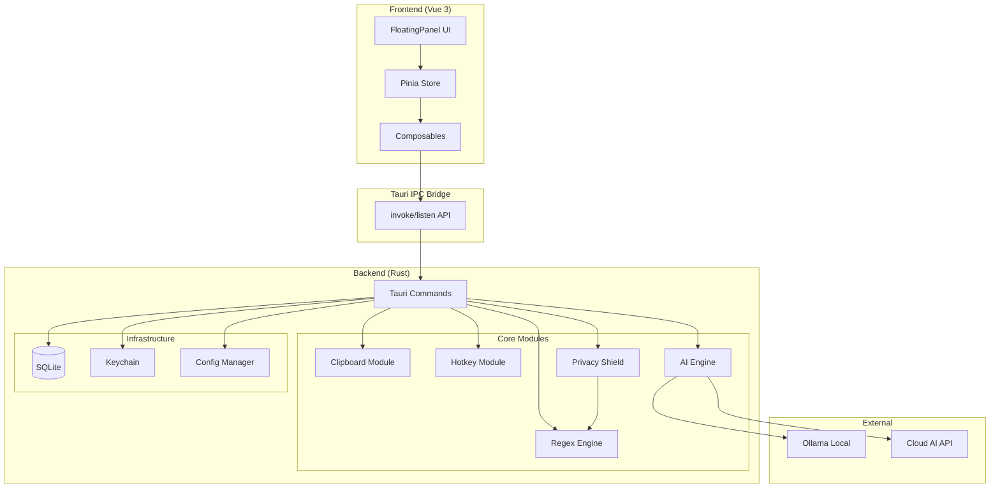

# Design Document - FlowPaste (MVP v1.0)

## Overview

FlowPaste 是基于 Tauri 框架的跨平台桌面应用，采用 Rust 后端 + Vue 前端架构。系统核心是一个 Spotlight 风格的悬浮面板，通过全局快捷键唤起，提供剪贴板内容的智能处理能力。

**技术栈：**
- **Backend:** Rust (Tauri 2.x)
- **Frontend:** Vue 3 + TypeScript + TailwindCSS
- **Storage:** SQLite (via rusqlite) + OS Keychain
- **AI Integration:** OpenAI-compatible API + Ollama

## Architecture

### High-Level Architecture



### Modular Design Principles

- **Single File Responsibility:** 每个模块文件只负责一个核心功能
- **Component Isolation:** UI 组件细粒度拆分，便于测试和复用
- **Service Layer Separation:** Rust 后端分为 Commands / Services / Infrastructure 三层
- **Utility Modularity:** 正则规则、PII 模式等作为独立配置模块

### IPC Event Specification

Frontend 与 Backend 之间的事件通信遵循统一命名规范：

| Event Name | Direction | Payload | Description |
|:-----------|:----------|:--------|:------------|
| `panel:toggle` | Backend → Frontend | `{ visible: boolean }` | 热键触发面板显示/隐藏 |
| `panel:hide` | Frontend → Backend | `null` | 请求隐藏面板 |
| `ai:chunk` | Backend → Frontend | `{ content: string, done: false }` | AI 流式响应片段 |
| `ai:done` | Backend → Frontend | `{ content: string, done: true }` | AI 响应完成 |
| `ai:error` | Backend → Frontend | `{ code: string, message: string }` | AI 请求错误 |
| `ai:cancel` | Frontend → Backend | `{ request_id: string }` | 取消 AI 请求 |
| `clipboard:changed` | Backend → Frontend | `{ has_text: boolean }` | 剪贴板内容变化 |

**命名约定:**
- 使用 `module:action` 格式
- 模块名: `panel`, `ai`, `clipboard`, `config`
- 动作名: `toggle`, `chunk`, `done`, `error`, `cancel`, `changed`

### Window Behavior Specification

FloatingPanel 窗口遵循以下行为规范：

| Trigger | Behavior | Notes |
|:--------|:---------|:------|
| 热键按下 | 显示面板（居中） | 自动聚焦输入框 |
| 热键再次按下 | 隐藏面板 | 保留当前状态 |
| Esc 键 | 隐藏面板 | 取消当前操作 |
| 点击面板外部 | 隐藏面板 | 失焦自动隐藏 |
| AI 处理中失焦 | 后台继续处理 | 完成后发送系统通知 |
| Enter 确认 | 粘贴并隐藏 | 结果上屏 |

**防抖机制:**
- 显示/隐藏切换间隔最小 100ms
- 避免快速重复热键导致的闪烁

## Components and Interfaces

### Backend Components (Rust)

#### 1. Clipboard Module (`src-tauri/src/clipboard/`)

- **Purpose:** 系统剪贴板读写操作
- **Interfaces:**
  ```rust
  pub fn read_clipboard() -> Result<String, ClipboardError>
  pub fn write_clipboard(content: &str) -> Result<(), ClipboardError>
  ```
- **Dependencies:** `arboard` crate
- **Reuses:** None (基础模块)

#### 2. Hotkey Module (`src-tauri/src/hotkey/`)

- **Purpose:** 全局快捷键注册与监听
- **Interfaces:**
  ```rust
  pub fn register_hotkey(keys: &str) -> Result<(), HotkeyError>
  pub fn unregister_hotkey() -> Result<(), HotkeyError>
  pub fn get_current_hotkey() -> String
  ```
- **Dependencies:** Tauri global-shortcut plugin
- **Reuses:** Config Manager (读取用户配置)

#### 3. AI Engine (`src-tauri/src/ai/`)

- **Purpose:** AI 模型调用统一接口
- **Interfaces:**
  ```rust
  pub async fn complete(prompt: &str, config: &AIConfig) -> Result<StreamingResponse, AIError>
  pub async fn detect_intent(text: &str) -> Result<Vec<ActionChip>, AIError>
  pub fn list_local_models() -> Result<Vec<ModelInfo>, AIError>
  ```
- **Dependencies:** `reqwest`, `tokio`, `serde_json`
- **Reuses:** Config Manager, Privacy Shield (预处理)

#### 4. Privacy Shield (`src-tauri/src/privacy/`)

- **Purpose:** PII 检测、脱敏与还原
- **Interfaces:**
  ```rust
  pub fn scan_pii(text: &str) -> PIIScanResult
  pub fn mask_pii(text: &str, scan: &PIIScanResult) -> (String, MaskMapping)
  pub fn restore_pii(text: &str, mapping: &MaskMapping) -> String
  ```
- **Dependencies:** `regex` crate
- **Reuses:** Regex Engine (PII patterns)

#### 5. Regex Engine (`src-tauri/src/regex/`)

- **Purpose:** 本地文本处理规则
- **Interfaces:**
  ```rust
  pub fn apply_rule(text: &str, rule: &Rule) -> String
  pub fn get_builtin_rules() -> Vec<Rule>
  ```
- **Dependencies:** `regex` crate
- **Reuses:** None (基础模块)

#### 6. Config Manager (`src-tauri/src/config/`)

- **Purpose:** 用户配置管理
- **Interfaces:**
  ```rust
  pub fn load_config() -> Result<AppConfig, ConfigError>
  pub fn save_config(config: &AppConfig) -> Result<(), ConfigError>
  pub fn get_api_key(provider: &str) -> Result<String, KeychainError>
  pub fn set_api_key(provider: &str, key: &str) -> Result<(), KeychainError>
  ```
- **Dependencies:** `rusqlite`, `keyring` crate
- **Reuses:** None (基础模块)

### Frontend Components (Vue 3)

#### 1. FloatingPanel (`src/components/FloatingPanel.vue`)

- **Purpose:** 主界面容器，Spotlight 风格悬浮窗
- **Props:** None (根组件)
- **State:** 通过 Pinia store 管理 `panelState`, `clipboardContent`, `processingStatus`
- **Dependencies:** CommandInput, Preview, ActionChips, PrivacyIndicator

#### 2. CommandInput (`src/components/CommandInput.vue`)

- **Purpose:** 顶部输入框，支持自然语言指令
- **Props:**
  ```typescript
  defineProps<{
    placeholder?: string
    disabled?: boolean
  }>()

  defineEmits<{
    submit: [command: string]
  }>()
  ```
- **Dependencies:** None

#### 3. Preview (`src/components/Preview.vue`)

- **Purpose:** 剪贴板内容预览 + 处理结果展示
- **Props:**
  ```typescript
  defineProps<{
    content: string
    mode: 'preview' | 'result' | 'streaming'
    highlight?: boolean
  }>()
  ```
- **Dependencies:** `shiki` (代码高亮)

#### 4. ActionChips (`src/components/ActionChips.vue`)

- **Purpose:** AI 推荐操作按钮组
- **Props:**
  ```typescript
  defineProps<{
    chips: ActionChip[]
    selectedIndex?: number
  }>()

  defineEmits<{
    select: [chip: ActionChip]
  }>()
  ```
- **Dependencies:** None

#### 5. PrivacyIndicator (`src/components/PrivacyIndicator.vue`)

- **Purpose:** 隐私盾状态指示器
- **Props:**
  ```typescript
  defineProps<{
    status: 'local' | 'cloud-safe' | 'cloud-masked'
    maskedCount?: number
  }>()
  ```
- **Dependencies:** None

### State Management (Pinia)

```typescript
// src/stores/app.ts
export const useAppStore = defineStore('app', () => {
  // Panel State
  const isVisible = ref(false)
  const panelMode = ref<'idle' | 'preview' | 'processing' | 'result'>('idle')

  // Content
  const clipboardContent = ref('')
  const processedContent = ref('')
  const streamingContent = ref('')

  // AI
  const actionChips = ref<ActionChip[]>([])
  const selectedChipIndex = ref(0)

  // Privacy
  const privacyStatus = ref<PrivacyStatus>({ type: 'local' })
  const maskedMapping = ref<Record<string, string>>({})

  // Actions
  async function showPanel() { /* ... */ }
  async function hidePanel() { /* ... */ }
  async function processWithRule(ruleId: string) { /* ... */ }
  async function processWithAI(prompt: string) { /* ... */ }
  async function confirmPaste() { /* ... */ }

  return {
    isVisible, panelMode,
    clipboardContent, processedContent, streamingContent,
    actionChips, selectedChipIndex,
    privacyStatus, maskedMapping,
    showPanel, hidePanel, processWithRule, processWithAI, confirmPaste
  }
})
```

## Data Models

### AppConfig (SQLite)

```sql
CREATE TABLE config (
  key TEXT PRIMARY KEY,
  value TEXT NOT NULL,
  updated_at INTEGER NOT NULL
);

-- Example keys:
-- 'hotkey' -> 'CommandOrControl+Shift+V'
-- 'ai_provider' -> 'openai' | 'ollama'
-- 'ollama_base_url' -> 'http://localhost:11434'
-- 'openai_base_url' -> 'https://api.openai.com/v1'
-- 'model_name' -> 'gpt-4o-mini'
-- 'theme' -> 'system' | 'light' | 'dark'
```

### Rule

```rust
pub struct Rule {
    pub id: String,
    pub name: String,
    pub description: String,
    pub pattern: String,       // Regex pattern
    pub replacement: String,   // Replacement template
    pub is_builtin: bool,
}
```

### ActionChip

```rust
pub struct ActionChip {
    pub id: String,
    pub label: String,
    pub action_type: ActionType,  // LocalRule | AIPrompt
    pub payload: String,          // rule_id or prompt template
    pub shortcut: Option<char>,   // '1', '2', '3'
}
```

### PIIScanResult

```rust
pub struct PIIScanResult {
    pub has_pii: bool,
    pub items: Vec<PIIItem>,
}

pub struct PIIItem {
    pub pii_type: PIIType,    // Phone, Email, IDCard, BankCard, IP, APIKey
    pub value: String,
    pub start: usize,
    pub end: usize,
}

pub struct MaskMapping {
    pub mappings: HashMap<String, String>,  // {{PHONE_01}} -> 13800138000
}
```

### AIConfig

```rust
pub struct AIConfig {
    pub provider: AIProvider,     // OpenAI | Ollama
    pub base_url: String,
    pub model: String,
    pub api_key: Option<String>,  // From keychain, None for Ollama
    pub max_tokens: u32,
    pub temperature: f32,
}
```

## Error Handling

### Error Scenarios

1. **Clipboard Access Failure**
   - **Handling:** 返回 `ClipboardError::AccessDenied`，前端显示权限提示
   - **User Impact:** 面板显示 "无法访问剪贴板，请检查权限设置"

2. **API Key Missing/Invalid**
   - **Handling:** 返回 `AIError::AuthenticationFailed`
   - **User Impact:** 面板显示 "API 密钥无效，请在设置中配置"，提供跳转按钮

3. **Network Timeout**
   - **Handling:** 5s 超时后返回 `AIError::Timeout`
   - **User Impact:** 面板轻微抖动，显示 "请求超时，点击重试"

4. **Ollama Not Running**
   - **Handling:** 连接失败返回 `AIError::ConnectionRefused`
   - **User Impact:** 显示 "无法连接本地模型，请确认 Ollama 已启动"

5. **PII Restoration Failure**
   - **Handling:** 占位符未找到时保留原文，记录 warning
   - **User Impact:** 结果中可能显示 `{{TYPE_ID}}` 占位符，提示用户检查

### Error Response Format

```rust
#[derive(Serialize)]
pub struct ErrorResponse {
    pub code: String,
    pub message: String,
    pub recoverable: bool,
    pub action: Option<ErrorAction>,  // Retry | Settings | Dismiss
}
```

## Testing Strategy

### Unit Testing

**Backend (Rust):**
- Regex Engine: 测试所有内置规则的正确性
- Privacy Shield: 测试各类 PII 模式的检测准确率
- Config Manager: 测试配置读写的正确性

```rust
#[cfg(test)]
mod tests {
    #[test]
    fn test_phone_detection() {
        let result = scan_pii("联系人：张三，手机：13800138000");
        assert_eq!(result.items.len(), 1);
        assert_eq!(result.items[0].pii_type, PIIType::Phone);
    }
}
```

**Frontend (Vue):**
- Components: 使用 Vitest + Vue Test Utils
- Store: 测试 Pinia actions 的状态变更

### Integration Testing

- **IPC 通信:** 测试 Tauri commands 的调用与返回
- **AI Pipeline:** Mock AI 响应，测试完整的 mask -> call -> restore 流程
- **Hotkey:** 测试快捷键注册、触发、面板显示的完整流程

### End-to-End Testing

使用 Playwright + Tauri Driver:

1. **基础流程:** 快捷键唤起 → 选择规则 → 确认粘贴
2. **AI 流程:** 输入指令 → 等待响应 → 确认结果
3. **隐私流程:** 包含 PII 的文本 → 验证脱敏 → 验证还原
4. **错误恢复:** 模拟网络断开 → 验证错误提示 → 验证重试功能

## File Structure

```
flow-paste/
├── src-tauri/
│   ├── src/
│   │   ├── main.rs              # Tauri entry point
│   │   ├── commands/            # Tauri command handlers
│   │   │   ├── mod.rs
│   │   │   ├── clipboard.rs
│   │   │   ├── ai.rs
│   │   │   └── config.rs
│   │   ├── clipboard/
│   │   │   ├── mod.rs
│   │   │   └── manager.rs
│   │   ├── hotkey/
│   │   │   ├── mod.rs
│   │   │   └── manager.rs
│   │   ├── ai/
│   │   │   ├── mod.rs
│   │   │   ├── openai.rs
│   │   │   ├── ollama.rs
│   │   │   └── intent.rs
│   │   ├── privacy/
│   │   │   ├── mod.rs
│   │   │   ├── scanner.rs
│   │   │   ├── masker.rs
│   │   │   └── patterns.rs
│   │   ├── regex/
│   │   │   ├── mod.rs
│   │   │   └── rules.rs
│   │   └── config/
│   │       ├── mod.rs
│   │       ├── store.rs
│   │       └── keychain.rs
│   ├── Cargo.toml
│   └── tauri.conf.json
├── src/
│   ├── main.ts                  # Vue entry
│   ├── App.vue
│   ├── components/
│   │   ├── FloatingPanel.vue
│   │   ├── CommandInput.vue
│   │   ├── Preview.vue
│   │   ├── ActionChips.vue
│   │   └── PrivacyIndicator.vue
│   ├── stores/
│   │   └── app.ts               # Pinia store
│   ├── composables/
│   │   ├── useClipboard.ts
│   │   ├── useHotkey.ts
│   │   └── useAI.ts
│   ├── lib/
│   │   └── tauri.ts             # IPC wrapper
│   └── types/
│       └── index.ts
├── package.json
└── vite.config.ts
```
