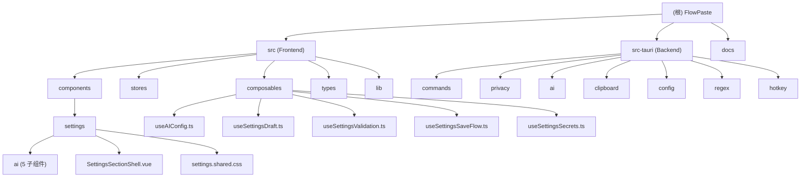

# FlowPaste (妙贴) - AI Context Documentation

> **Last Updated**: 2025-12-30T16:00:00.000Z
> **Version**: 0.1.0
> **Status**: Active Development

---

## 变更记录 (Changelog)

### 2025-12-30
- **设置面板模块化重构**
  - 样式提取：创建 `settings.shared.css` 统一样式（消除 ~300 行重复 CSS）
  - AIConfigSection 拆分：从 508 行精简至 92 行，拆分为 5 个子组件
  - 表单状态管理：新增 4 个专用 composables（Draft/Secrets/Validation/SaveFlow）
  - 修复 Tauri 窗口内容显示问题
- 初始化 AI 上下文文档
- 生成项目架构图与模块索引
- 建立覆盖率基线 (60%)

---

## 项目愿景

FlowPaste 是一款**完全开源、隐私优先、AI 驱动**的智能剪贴板增强工具。作为首款开源 AI 剪贴板管理器，通过极致的使用体验和灵活的自定义模型配置，让文本处理变得前所未有的流畅。

**核心价值**:
- **Flow (心流)**: 键盘优先设计，全局热键唤起，毫秒级响应，保持工作专注
- **Model Freedom (模型自由)**: 支持 Ollama 本地模型和任意 OpenAI 兼容 API，完全掌控 AI 选择权
- **Privacy (隐私)**: 敏感数据本地脱敏，云端占位符处理，API Key 安全存储
- **Open Source (开源透明)**: MIT 协议，代码完全开放，社区驱动发展

---

## 架构总览

FlowPaste 采用 **Tauri + Vue 3 + Rust** 混合架构，前端负责 UI 交互与状态管理，后端负责系统集成、AI 调用、隐私保护与数据持久化。

**技术栈**:
- **前端**: Vue 3 + TypeScript + Pinia + TailwindCSS + Vite
- **后端**: Rust + Tauri 2.x + SQLite + Keyring
- **AI 集成**: Ollama (本地) / OpenAI 兼容 API (云端)
- **剪贴板**: Tauri Clipboard Manager Plugin + Enigo (键盘模拟)

**核心模块**:
1. **前端 (src/)**: Vue 组件、状态管理、Tauri IPC 调用
2. **后端 (src-tauri/)**: Rust 命令模块、AI 提供商、隐私扫描、配置管理

---

## 模块结构图



---

## 模块索引

| 模块路径 | 职责 | 语言 | 入口文件 | 文档链接 |
|---------|------|------|---------|---------|
| **src** | 前端 UI 与交互逻辑 | TypeScript/Vue | `src/main.ts`, `src/App.vue` | [Frontend CLAUDE.md](./src/CLAUDE.md) |
| **src-tauri** | 后端系统集成与业务逻辑 | Rust | `src-tauri/src/main.rs`, `src-tauri/src/lib.rs` | [Backend CLAUDE.md](./src-tauri/CLAUDE.md) |
| **docs** | 产品需求与设计文档 | Markdown | `docs/prd.md` | [Docs CLAUDE.md](./docs/CLAUDE.md) |

---

## 运行与开发

### 前置要求
- **Node.js**: >= 18
- **Rust**: >= 1.70
- **pnpm/npm**: 包管理器
- **Ollama** (可选): 本地 AI 模型支持

### 快速启动

```bash
# 1. 安装依赖
npm install

# 2. 开发模式运行
npm run tauri:dev

# 3. 构建发布版本
npm run tauri:build
```

### 配置本地 AI 模型

```bash
# 安装 Ollama
# 参考: https://ollama.com/

# 下载模型
ollama pull llama3.2

# 启动 Ollama 服务
ollama serve
```

在应用中按 `Ctrl+,` 打开设置，选择 Ollama 提供商，填写模型名称 `llama3.2`。

### 配置云端 API

在设置面板中选择 OpenAI 提供商，填写 API Key（自动存储在系统密钥链），设置 Base URL 和模型名称。

---

## 测试策略

### 当前状态
- **前端**: 无自动化测试（待建立 Vitest + Vue Test Utils）
- **后端**: 无集成测试（待建立 Cargo test suite）

### 规划
1. **单元测试**:
   - 前端: 核心 Store 逻辑、类型转换、工具函数
   - 后端: 隐私扫描器、规则引擎、AI Provider
2. **集成测试**:
   - Tauri 命令调用完整性
   - AI 提供商连接性（Mock）
3. **E2E 测试**:
   - 全局热键触发 -> 剪贴板读取 -> AI 处理 -> 粘贴回目标应用

---

## 编码规范

### TypeScript/Vue
- **严格模式**: `strict: true`
- **命名**: PascalCase (组件), camelCase (函数/变量), SCREAMING_SNAKE_CASE (常量)
- **Composables**: 单一职责，以 `use` 开头
- **Store**: Pinia 组合式 API，导出细粒度 getters/actions

### Rust
- **格式化**: `cargo fmt` (Rustfmt 默认规则)
- **Lint**: `cargo clippy -- -D warnings`
- **错误处理**: 使用 `thiserror` 定义错误类型，避免 `unwrap()`
- **异步**: Tokio runtime，优先 `async-trait`

### 通用原则
- **精简高效**: 无冗余代码与注释
- **非必要不形成文档**: 代码自解释优先
- **针对性改动**: 仅修改需求相关模块，避免副作用

---

## AI 使用指引

### 前端开发
- **上下文检索**: 使用 `ace-tool` 检索相关组件、Store 定义
- **组件修改**: 读取 `src/types/index.ts` 确认类型定义，避免类型不匹配
- **状态管理**: 修改 Store 前，确认依赖组件是否受影响

### 后端开发
- **命令添加**: 在 `src-tauri/src/commands/` 添加模块，在 `lib.rs` 注册 `invoke_handler`
- **隐私保护**: 涉及 PII 的功能，必须调用 `privacy::scanner` 预扫描
- **AI 调用**: 使用 `ai::provider` trait，支持多提供商切换

### 跨模块协作
- **前后端通信**: 通过 Tauri `invoke` 调用命令，参数类型需在前后端同步
- **IPC 事件**: 使用 `src/types/index.ts` 中的 `IPC_EVENTS` 常量，避免硬编码事件名

---

## 相关文件清单

### 核心配置文件
- `package.json` - 前端依赖与构建脚本
- `src-tauri/Cargo.toml` - 后端依赖与编译选项
- `src-tauri/tauri.conf.json` - Tauri 窗口与权限配置
- `tsconfig.json` - TypeScript 编译选项
- `vite.config.ts` - Vite 构建配置
- `tailwind.config.js` - TailwindCSS 样式配置

### 关键源文件
- `src/main.ts` - 前端入口
- `src/App.vue` - 根组件
- `src/stores/app.ts` - 全局状态管理
- `src/types/index.ts` - 类型定义中心
- `src-tauri/src/lib.rs` - 后端入口与命令注册
- `src-tauri/src/commands/mod.rs` - 命令模块索引

### 设置面板组件 (重构后)
- `src/components/SettingsPanel.vue` - 设置面板主入口
- `src/components/settings/SettingsSectionShell.vue` - 统一 Section 容器
- `src/components/settings/settings.shared.css` - 共享样式
- `src/components/settings/GeneralSection.vue` - 通用设置
- `src/components/settings/AIConfigSection.vue` - AI 配置入口
- `src/components/settings/QuickActionsSection.vue` - 快捷操作
- `src/components/settings/ai/` - AI 配置子组件（5 个）

### Composables (表单状态管理)
- `src/composables/useAIConfig.ts` - AI 配置逻辑（模型列表、连接测试）
- `src/composables/useSettingsDraft.ts` - 草稿状态与脏检测
- `src/composables/useSettingsSecrets.ts` - API Key 安全存储
- `src/composables/useSettingsValidation.ts` - 表单验证
- `src/composables/useSettingsSaveFlow.ts` - 保存流程编排

### 文档
- `README.md` - 用户指南
- `docs/prd.md` - 产品需求文档

---

## 常见问题 (FAQ)

### Q: 如何添加新的快捷操作？
**A**:
1. 在 `src-tauri/src/regex/mod.rs` 定义新规则
2. 在 `get_builtin_rules` 中注册
3. 前端会自动读取并显示在 QuickActions 组件中

### Q: 如何支持新的 AI 提供商？
**A**:
1. 在 `src-tauri/src/ai/` 创建新的 Provider 模块
2. 实现 `AIProvider` trait
3. 在 `ai/provider.rs` 中注册新提供商

### Q: 隐私扫描如何自定义？
**A**:
1. 修改 `src-tauri/src/privacy/patterns.rs` 添加新的正则模式
2. 在 `scanner.rs` 的 `scan_pii` 函数中注册新模式

### Q: 为什么 AI 响应很慢？
**A**:
- 检查网络连接（云端 API）
- 检查 Ollama 服务状态（本地模型）
- 尝试更换更小的模型（如 `llama3.2:1b`）

---

**备注**: 本文档由架构初始化工具自动生成，建议根据项目演进手动更新关键章节。
